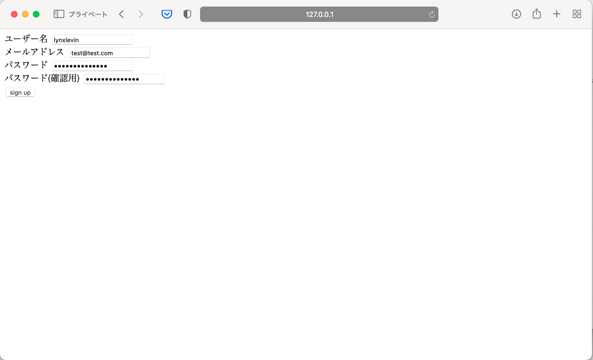
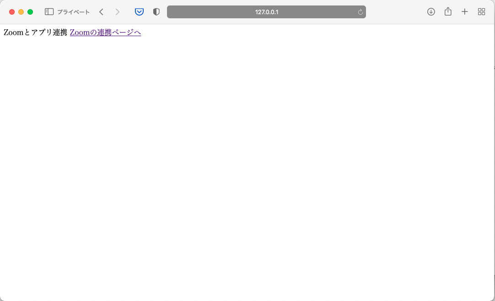
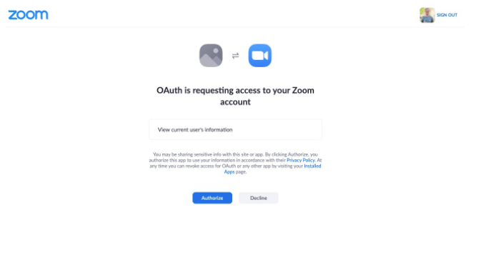
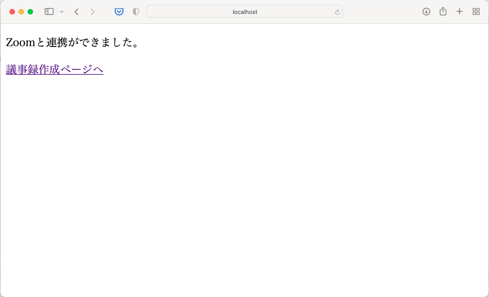

## Access Token取得の画面フロー

1. `python3 manage.py runserver`コマンドでサーバーを立ち上げる
2. `http://127.0.0.1:8000/user/signup/`にアクセスし、ユーザー登録を行う

3. `http://127.0.0.1:8000/user/zoom/auth/init`にアクセスし、`Zoomの連携ページへ`のリンクを押下する

4. 遷移先のページで`連携`または`Authorize`を押下する

5. `http://127.0.0.1:8000/user/zoom/auth/return`にリダイレクトされ、Access Tokenの取得が完了する

