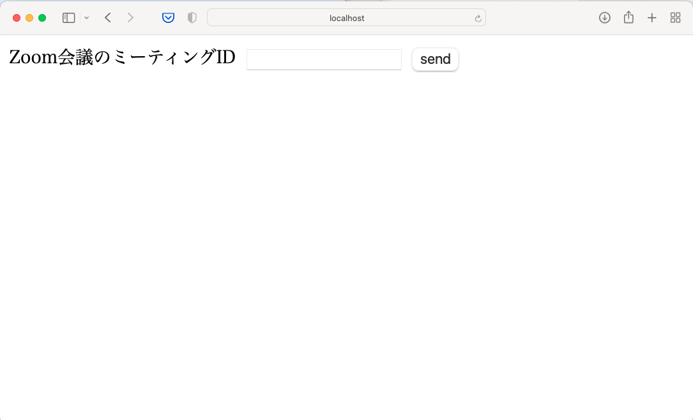
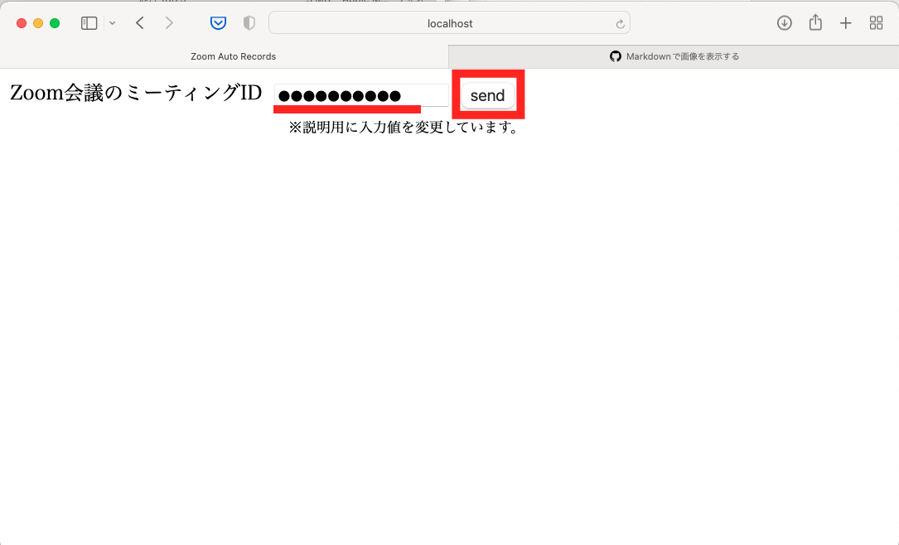
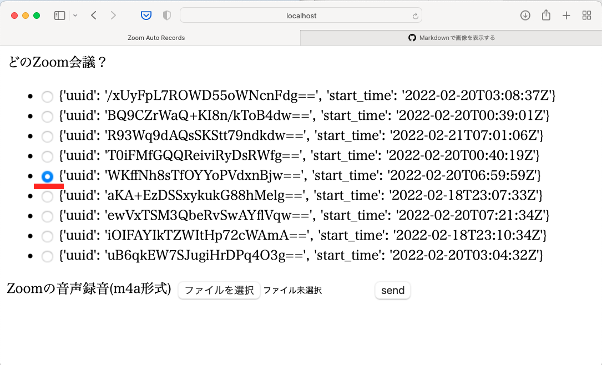
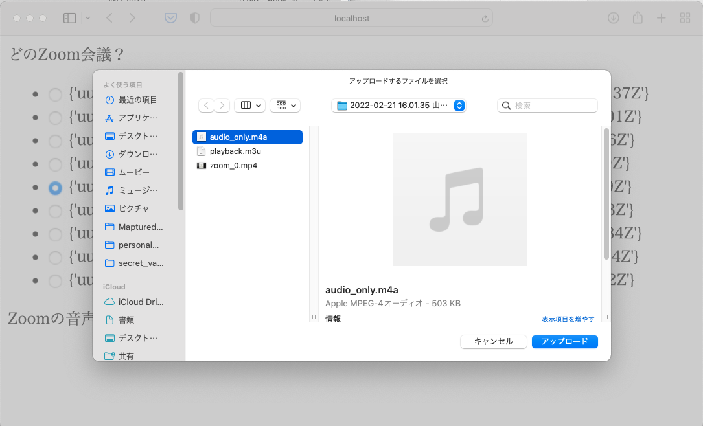
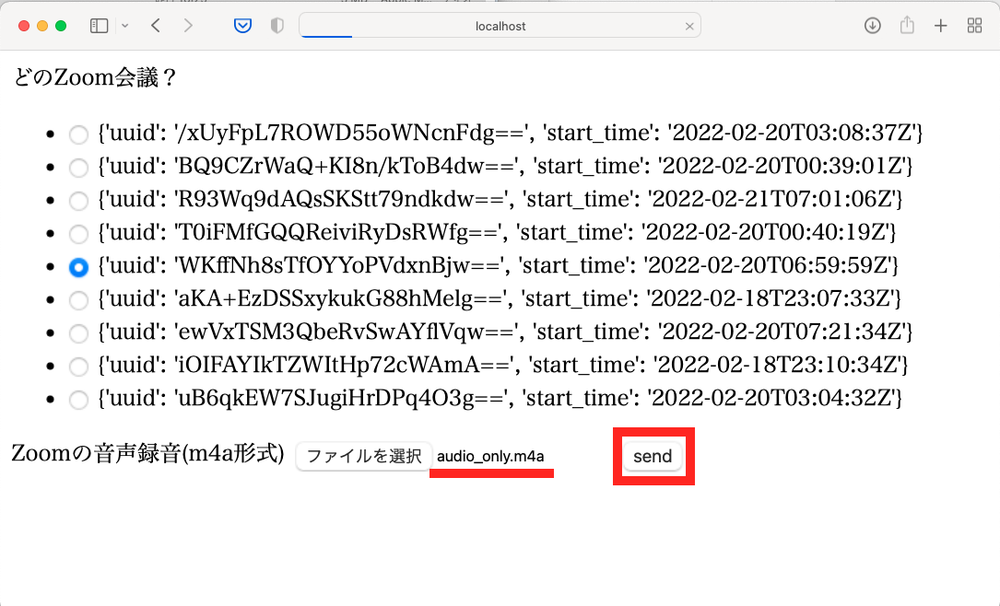
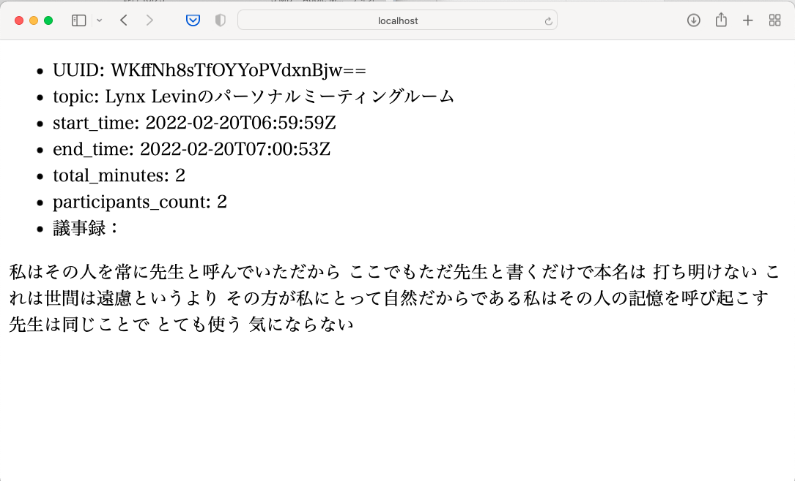

1. `python3 manage.py runserver`コマンドでサーバーを立ち上げる
2. `http://localhost:8000/audio/`にアクセスする

3. 自分のZoomのミーティングIDを入力し、`send`を押下する

4. start_timeを元に会議を選択する

5. 会議の音声ファイル(m4a形式)をアップロードする

6. `send`を押下する

7. 処理完了後、会議の概要と文字起こしされた議事録が表示される

