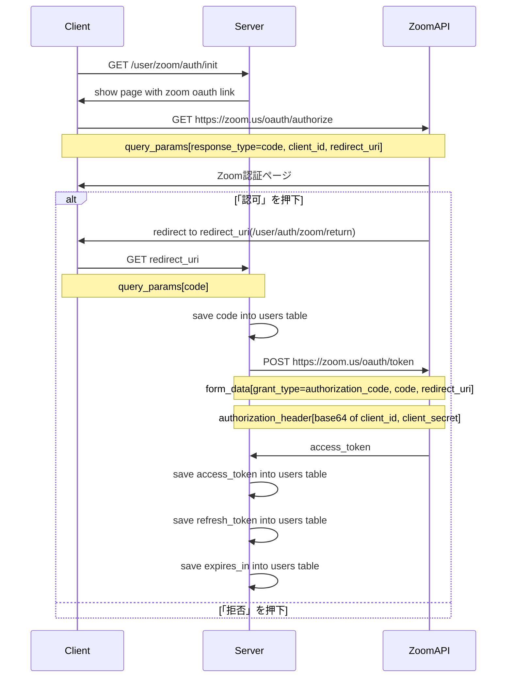

```mermaid
sequenceDiagram
    participant c as Client
    participant s as Server
    participant z as ZoomAPI
    c->>s: GET /user/zoom/auth/init
    s->>c: show page with zoom oauth link
    c->>z: GET https://zoom.us/oauth/authorize
    Note over c, z: query_params[response_type=code, client_id, redirect_uri]
    z->>c: Zoom認証ページ
    alt 「認可」を押下
        z->>c: redirect to redirect_uri(/user/auth/zoom/return)
        c->>s: GET redirect_uri
        Note over c, s: query_params[code]
        s->>s: save code into users table
        s->>z: POST https://zoom.us/oauth/token
        Note over s, z: form_data[grant_type=authorization_code, code, redirect_uri]
        Note over s, z: authorization_header[base64 of client_id, client_secret]
        z->>s: access_token
        s->>s: save access_token into users table
        s->>s: save refresh_token into users table
        s->>s: save expires_in into users table
    else 「拒否」を押下
    end
```